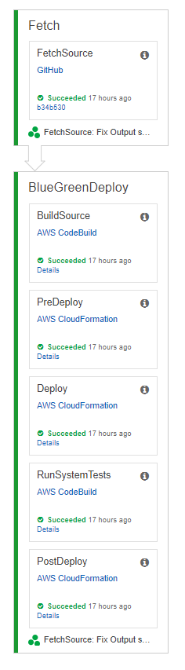

# Totem

Totem is a [blue-green](https://martinfowler.com/bliki/BlueGreenDeployment.html) pipeline for [AWS CloudFormation](https://aws.amazon.com/cloudformation/).  If you define your AWS infrastructure with CloudFormation, then Totem can help you to continuously deploy it.  Totem is powered by [AWS CloudFormation](https://aws.amazon.com/cloudformation), [AWS CodePipeline](https://aws.amazon.com/codepipeline), [AWS CodeBuild](https://aws.amazon.com/codebuild), [Amazon S3](https://aws.amazon.com/s3), and [AWS IAM](https://aws.amazon.com/iam).  Totem is infrastructure code that you deploy to your AWS account.

## Quick start

### Options for getting Totem

*  You can one-click deploy Totem into your AWS account.
* Totem uses Amazon S3 for distribution.  [Totem is available from S3](https://s3.amazonaws.com/totem-release/com/d2l/totem/0.0.2/totem-0.0.2.yaml), to both the AWS console and the AWS CLI.

### Instructions for using Totem with the sample application

* Fork the [totem-sample](https://github.com/Brightspace/totem-sample) repository.  Your new Totem pipeline will build and deploy your fork of the sample application.
* Create an access token for your fork's owner, which has full **admin:repo_hook** and **repo** permissions.  CodePipeline requires this owner/token pair to access your fork on GitHub.  See [Creating a personal access token for the command line](https://help.github.com/articles/creating-a-personal-access-token-for-the-command-line/) and [To configure a pipeline to use a personal access token from GitHub](http://docs.aws.amazon.com/codepipeline/latest/userguide/troubleshooting.html#troubleshooting-gs2).
* Single-click to deploy a Totem pipeline to AWS.  Provide the repository, owner, and token information as parameter-overrides to Totem.

## Documentation

Totem works together with your application templates to blue-green deploy your application.  During each pipeline run, Totem creates and uses a blue-green AWS CloudFormation template to drive application deployment.

### An overview of Totem

The Totem pipeline is defined in this repository as **totem.yaml**.  It is an AWS CodePipeline pipeline with two phases and six actions:

1. In the **Fetch** phase, Totem watches your application repository for changes.  When Totem notices a change, it retrieves the changes and initiates a pipeline run.
   1. During the **FetchSource** action, Totem retrieves your application code from either CodeCommit or GitHub.
1. In the **BlueGreenDeploy** phase, Totem builds and deploys your application.
   1. During the **BuildSource** action, Totem builds your application.  As part of the build, it folds your application templates into a parent AWS CloudFormation blue-green template.  This blue-green template drives the deployment for the rest of the pipeline run.
   1. During the **PreDeploy** action, Totem updates any existing blue-green stack for a new deployment.  It ensures that your application's infrastructure dependencies are available and that the blue-green stack is in a clean and consistent state.
   1. During the **Deploy** action, Totem deploys a new application stack and its test dependencies.  This new stack is an independent copy of your application, which can be fully tested in isolation.  This isolated stack is Totem's candidate for blue-green promotion.
   1. During the **RunSystemTests** action, Totem verifies the candidate stack with an AWS CodeBuild test project.  If the tests pass, then Totem will promote the new stack in the next action.
   1. During the **PostDeploy** action, Totem promotes the new application stack and cleans up any test dependencies.

### An overview of Totem's blue-green stack

Totem Client creates a blue-green AWS CloudFormation template, which drives Totem's blue-green deployment.  The blue-green template itself is made up of five nested stacks:
1. **BlueStack**, a copy of your application which is active during testing and when the pipeline is *blue*;
1. **GreenStack**, a copy of your application which is active during testing and when the pipeline is *green*;
1. **TestOutgressStack**, a test stack which is available during testing (containing, *e.g.*, a test Amazon DynamoDB table), and on which **BlueStack** and **GreenStack** depend,
1. **PermanentOutgressStack**, a stack of your application's permanent *depencies* (*e.g.*, an Amazon DynamoDB table), and
1. **PermanentIngressStack**, a stack of your application's permanent *dependents* (*e.g.*, an Amazon API Gateway BasePathMapping).

You can find and inspect Totem's blue-green stack in your account.  It appears as *\<totem stack name>* **-blue-green**.  The nested stacks are similarly available for inspection.

### A Totem example
How does Totem use its blue-green template to deploy your application?  This is best explained with an example.  Note that Totem switches state, either from blue to green or vice versa, on each successful pipeline run.  The example below covers a switch from *blue* to *green*; the switch from *green* to *blue* is similar.

1. During **FetchSource**, Totem fetches your application source code.  Totem assumes that your repository contains *src/cfn/main/{main.yaml, permanent-ingress.yaml, permanent-outgress.yaml}* and *src/cfn/test/test-outgress.yaml*.
1. During **BuildSource**, Totem combines your application template with its own blue-green template.
1. During **PreDeploy**, Totem ensures that
   * **GreenStack** is deleted,
   * **TestOutgressStack** is deleted,
   * **PermanentOutgressStack** and **PermanentIngressStack** are running,
   * **PermanentOutgressStack's** **OutputValues** Output is wired to **BlueStack's** **InputValues** Parameter,
   * **BlueStack's** **OutputValues** Output is wired to **PermanentIngressStack's** **InputValues** Parameter.
1. During **Deploy**, Totem
   * launches **GreenStack** and **TestOutgressStack**, and
   * wires **TestOutgress's** **OutputValues** Output to **GreenStack's** **InputValues** Parameter.
   (Totem does not currently have a **TestIngressStack** to match **PermanentIngressStack**.)
1. During **RunSystemTests**, Totem tests the **GreenStack** candidate.  If the tests pass, Totem proceeds to **PostDeploy**.
1. During **PostDeploy**, Totem promotes **GreenStack** and cleans up:
   * It unwires **PermanentOutgressStack's** **OutputValues** Output from **BlueStack's** **InputValues** Parameter.
   * It rewires **PermanentOutgressStack's** **OutputValues** Output to **GreenStack's** **InputValues** Parameter.
   * It unwires **PermanentIngressStack's** **InputValues** Parameter from **BlueStack's** **OutputValues** Output.
   * It rewires **PermanentIngressStack's** **InputValues** Parameter to **GreenStack's** **OutputValues** Output.
   * It deletes **TestOutgressStack**.

### Details on Totem's nested stacks

#### BlueStack and GreenStack
These stacks represent the part of your application that you want to blue-green deploy.
* Totem expects these stacks' to be defined by *src/cfn/main/main.yaml* in your repository.
  * You must provide this template.
* This template must define a Parameter named **InputValues** of Type **String**.
* Totem passes one of the following values into these stack's **InputValues** Parameters.
  * **PermanentOutgressStack** **OutputValues** Output or
  * **TestOutgressStack** **OutputValues** Output
* Totem treats the **OutputValues** value as opaque; its available for your stacks to communicate with one another.
* This template must define an Output named **OutputValues** of type String.
* Totem passes this stack's **OutputValues** Output into **PermanentIngressStack's** **InputValues** Parameter.  Totem also treats this value as opaque.

#### TestOutgressStack
This stack provides test-specific copies of your application's permanent dependencies.  For example, if your application depends on a Amazon DynamoDB table defined in **PermanentOutgressStack**, then you can define define a copy of the table, which is only used during tests, in **TestOutgressStack**.
* Totem expects *src/cfn/main/test-outgress.yaml* to live in your repository and define this stack.
  * You must provide this template.
* This template must define an Output named **OutputValues** of type String.
* During the **Deploy** action, Totem passes this stack's **OutputValues** Output into either
  * **BlueStack's** **InputValues** Parameter or
  * **GreenStack's** **InputValues** Parameter.
* Totem treats this value as opaque; it's a value-passing channel for your application.

#### PermanentOutgressStack
This stack defines your application's live (*i.e., production*) permanent dependencies.  Totem will launch this stack on its first run of the **PreDeploy** action.  For example, if your application depends on a Amazon DynamoDB Table that you do not want deleted during blue-green deployments, then you can define the table in **PermanentOutgressStack**.  Totem will not blue-green deploy this stack during pipeline runs but it *will* perform an in-place update whenever the stack's template changes.
* Totem expects *src/cfn/main/permanent-outgress.yaml* to live in your repository and define this stack.
  * You must provide this template.
* This template must define an Output named **OutputValues** of type String.
* During the **PreDeploy** and **PostDeploy** actions, Totem passes this stack's **OutputValues** Output into either
  * **BlueStack's** **InputValues** Parameter or
  * **GreenStack's** **InputValues** Parameter.
* Totem treats this value as opaque; it's a value-passing channel for your application to use.

#### PermanentIngressStack
This stack defines your application's live (*i.e., production*) permanent dependents.  Totem will launch this stack on its first run of the **PostDeploy** action.  For example, if an Amazon API Gateway BasePathMapping points at your application and you do not want to delete the mapping during blue-green deployments, then you can define the mapping in **PermanentIngressStack**.  Totem will not blue-green deploy this stack during pipeline runs but it *will* perform an in-place update whenever the stack's template changes.
* Totem expects **src/cfn/main/permanent-ingress.yaml** to live in your repository and define this stack.
  * You must provide this template.
* This template must define a Parameter named **InputValues** of type String.
* Totem passes the value from either
  * **BlueStack's** **OutputValues** Output or
  * **GreenStack's** **OutputValues** Output
  into this stacks **InputValues** Parameter.   Totem treats this as an opaque value; its provides a communication channel for your stacks.
* Totem treats this value as opaque; it's a value-passing channel for your application to use.

## Versioning

Totem is maintained under [the Semantic Versioning guidelines](http://semver.org/).  Prior to v1.0.0, Totem does not aim to deliver backward compatibility.

## Contributing

Please read through our [contributing guidelines](CONTRIBUTING.md). Included are directions for opening issues, coding standards, and notes on development.
